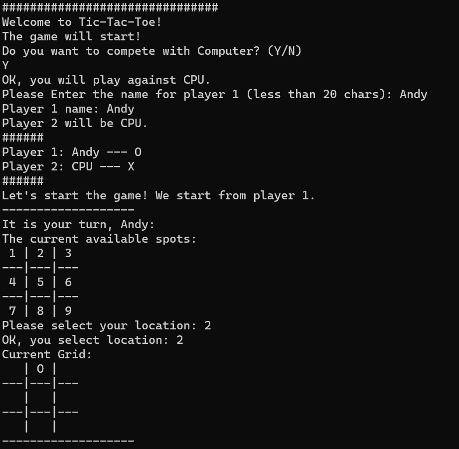

# TicTacToeInC
 A simple Tic-Tac-Toe game implemented in pure C.

A small project for C program beginner.

### Supported:
- Multi-player
- Single-player against a simple AI
- Endless game with the same players

### Screenshot


### How to play?
Use `cmake` or compile directly.
#### CMake
```shell
# in the root dir
mkdir build
cd build
cmake ..
cmake --build .
./TicTacToeInC
```

#### gcc
```shell
# in the root dir
gcc -o TicTacToeInC main.c draw.c interface.c logic.c
./TicTacToeInC
```